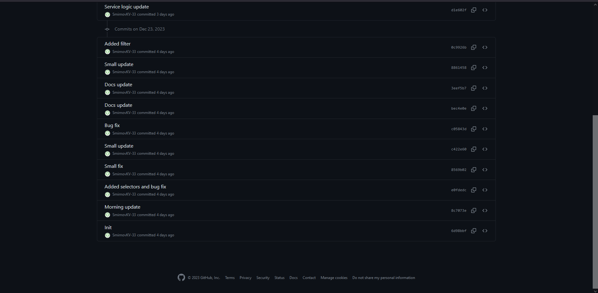
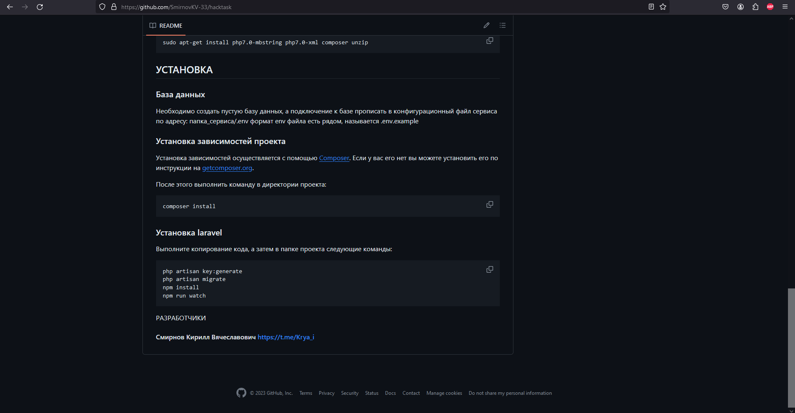

# Человек победил хакатон, как утверждается, в одиночку, при этом никак это не скрывая факт того, что весь код писал не он.

## Преамбула

Данная статья является обращением к участникам, спонсорам и организаторам хакатона - всем, кто за честный спорт. Мы ни в коем случае не призываем к оскорблениям и прочим радикальным мерам, однако хотим возвать к справедливости и уважению по отношению ко ***всем***, кто участвовал в данном мероприятии честно.

Отдельная благодарность выражается участникам от ЕВРАЗ, за проявленную бдительность и компетентность, а также попытку разобраться в ситуации до оценки результатов.

## Контекст

Место проведения - хакатон CyberGarden2023, кейс компании ЕВРАЗ. На данном треке присутствовало 10 команд, одной из таких была PLEXeT, состоящая из одного человека - Бахтадзе-Карнаухова Олега Георгиевича

## Too long, didnt read

Бахтадзе-Карнаухов Олег Георгиевич - одиночный участник из команды PLEXeT победил в хакатоне незаслуженно, все коммиты во всех его репозиториях ведут на другого человека - Смирнова Кирилла Вячеславовича, на что имеются все ссылки на публичные репозитории github.

## Предыстория

Участник из одиночной команды принес на защиту довольно сильное решение, с хорошо подготовленной презентацией, однако, наблюдая за ним во время хакатона, создавалось впечатление, будто он не слишком сильно заинтересован в победе, постоянно ходил от команды к команде, много беседовал со всеми. Данный участник также является победителем хакатона "Фича" (проводился летом 2023). По словам некоторых участников, на Фиче произошла такая же история - человек не особо трудился по мере работы, однако к защите появилось очень сильное приложение. 

В его профиле на гитхабе были обнаружены несостыковки - все коммиты были совершены другим человеком, с которым Олег знаком и работал ранее, однако, этот человек не был зарегистрирован как участник. 

## Разбор ссылок

В репозиториях CyberGarden2023 от команды PLEXeT [3] [4] имеется история коммитов, в который все изменения совершаются от аккаунта SmirnovKV-33 [6].

В профиле самого Смирнова Кирилла Вячеславовича имеется репа [7], в README которого имеются его контакты, указывающие на личность, владеющего профилем.

Цитата из README, [прямая ссылка](https://github.com/SmirnovKV-33/hacktask#%D1%81%D0%BC%D0%B8%D1%80%D0%BD%D0%BE%D0%B2-%D0%BA%D0%B8%D1%80%D0%B8%D0%BB%D0%BB-%D0%B2%D1%8F%D1%87%D0%B5%D1%81%D0%BB%D0%B0%D0%B2%D0%BE%D0%B2%D0%B8%D1%87-httpstmekrya_i):

> Смирнов Кирилл Вячеславович https://t.me/Krya_i

В репозитории хакатона "Фича" [5], датированный теми же числами, что и сам хакатон, также сохранилась история, в которой фигурирует всего один человек - Смирнов Кирилл

Также имеется репозиторий хакатона "Молодежный Бит" [8] (еще один победный хакатон Олега), в котором уже оффициально зарегистрирован как участник человек под именем Смирнов Кирилл Вячеславович. В этой репе также присутствуют только коммиты от аккаунта SmirnovKV-33

Цитата из README, [прямая ссылка на текст](https://github.com/olegator-rus/plexet-grant-writer#):

> Авторы проекта (члены команды): Жердева Алина Хасановна, Бахтадзе-Карнаухов Олег Георгиевич,
> Смирнов Кирилл Вячеславович. г. Пятигорск, 17 - 19 февраля 2023 года.

Из 8 открытых репозиториев в профиле Олега был найдет только один, в котором имеются коммиты от его аккаунта [10]. Стоит отметить, что хакатоны "Фича" и "CyberGarden" были написаны на PHP/Vue, как и открытый репозиторий Кирилла "hacktask" (название также отсылает к какому-то хакатону). Однако единственная открытая репа Олега показывает, что он писал на Go

## Выводы?

Никаких притензий к человеку не было бы, если бы все действительные участники команды были зарегистрированы. Какой смысл от участия и проведния таких мероприятий, если такие прецеденты существуют. CyberGarden - очень классное мероприятие с уникальной атмосферой, хотелось бы, чтобы оно и оставалось таким. Участие таких людей, как команда PLEXeT нарушает само определение хакатона, описанное в его положении

> 2.1. Хакатон – короткое, динамичное мероприятие, призванное
стимулировать появление новых идей в выбранной предметной области и
доведение их до реализации непосредственно на площадке Хакатона. Формат
Хакатона позволяет объединить участников различных профессий, с
различными уровнями знаний и навыков, и дать им возможность познакомиться
с новой предметной областью под руководством специалистов-практиков.
Творческая неформальная атмосфера Хакатона способствует созданию новых
команд и проектов, развитию IT-сообщества.

## Ссылки

1. [https://cybergarden.ru/file.pdf](https://cybergarden.ru/file.pdf) - Положение о проведении хакатона

2. [https://github.com/olegator-rus](https://github.com/olegator-rus) - Профиль Олега на github

3. [https://github.com/olegator-rus/green-garden-hack-frontend](https://github.com/olegator-rus/green-garden-hack-frontend) - Репозиторий клиентскогоприложения на CyberGarden2023

4. [https://github.com/olegator-rus/green-garden-hack-backend](https://github.com/olegator-rus/green-garden-hack-backend) - Репозиторий backend части наCyberGarden2023

5. [https://github.com/olegator-rus/titcha_hackathon](https://github.com/olegator-rus/titcha_hackathon) - Репозиторий хакатона "Фича"

6. https://github.com/SmirnovKV-33 - Профиль Смирнова Кирилла

7. [https://github.com/SmirnovKV-33/hacktask](https://github.com/SmirnovKV-33/hacktask) - Репозиторий Смирнова Кирилла с егоконтактами

8. [https://github.com/olegator-rus/plexet-grant-writer](https://github.com/olegator-rus/plexet-grant-writer) - Репозиторий хакатона "МолодежныйБит", в котором Кирилл является оффициальным участником

9. [https://t.me/ficha_it/426](https://t.me/ficha_it/426) - Пост в тг из оффициального канала "Фича", в котором определены победители, среди которых присутствует PLEXeT

10. [https://github.com/olegator-rus/BestHackaton2](https://github.com/olegator-rus/BestHackaton2) - Репозиторий олега на golang